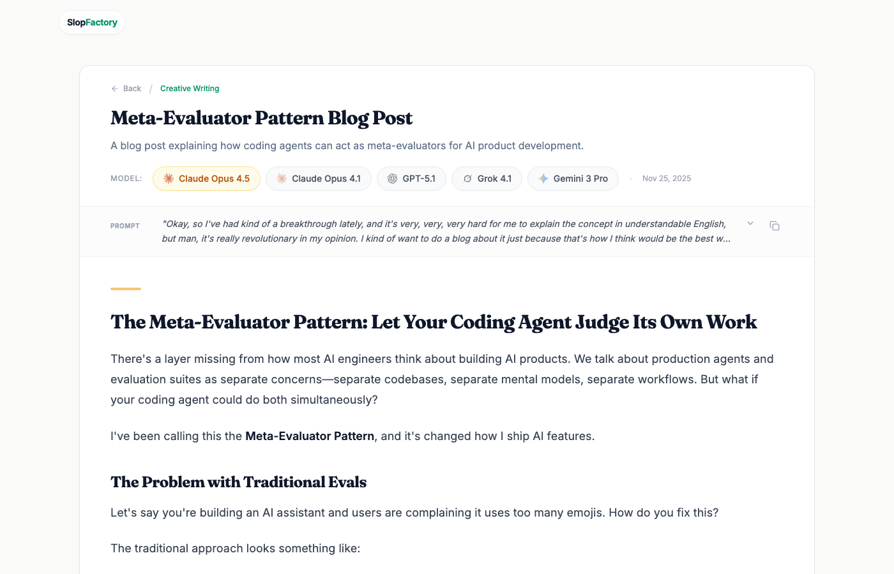

# SlopFactory

**A curated gallery comparing AI model outputs side-by-side.**

See how Claude, GPT, Gemini, and Grok interpret the same prompts across different creative tasks.

**[View Live Demo!](https://slop.wiseguyai.com)**

---

## What is SlopFactory?

SlopFactory is an archive of AI experiments where you can compare outputs from leading AI models given identical prompts. Switch between models to see different approaches, writing styles, and quality levels.


### Features

- **Side-by-side comparison** - Switch between model outputs with a single click
- **Multiple categories** - Stories, blog posts, images, landing pages, and more
- **Leading AI models** - Claude, GPT, Gemini, and Grok variants



---

## Run Locally

```bash
npm install
# Set GEMINI_API_KEY in .env.local
npm run dev
```
